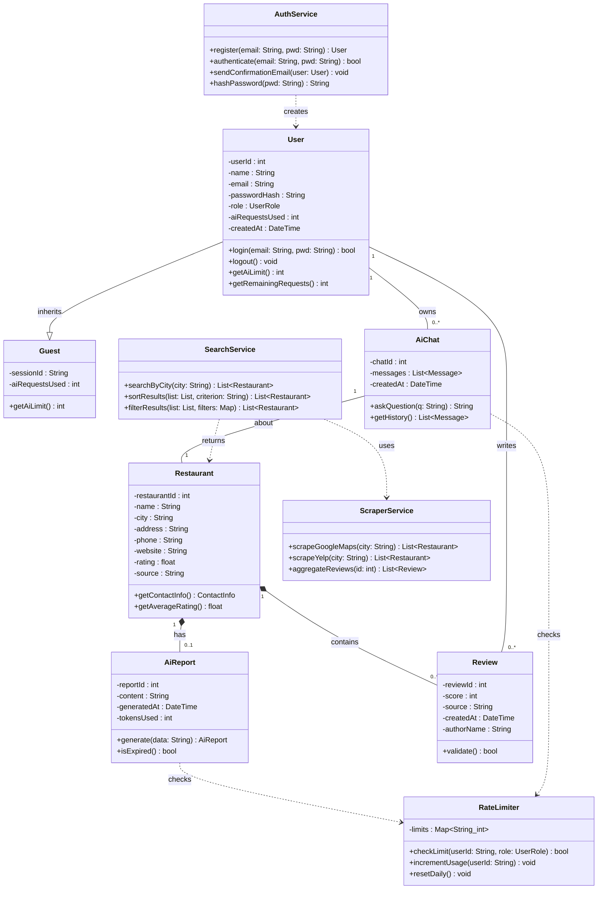

```mermaid
classDiagram
    class User {
        -userId : int
        -name : String
        -email : String
        -passwordHash : String
        -role : UserRole
        -aiRequestsUsed : int
        -createdAt : DateTime
        +login(email: String, pwd: String) bool
        +logout() void
        +getAiLimit() int
        +getRemainingRequests() int
    }
    class Guest {
        -sessionId : String
        -aiRequestsUsed : int
        +getAiLimit() int
    }
    class Restaurant {
        -restaurantId : int
        -name : String
        -city : String
        -address : String
        -phone : String
        -website : String
        -rating : float
        -source : String
        +getContactInfo() ContactInfo
        +getAverageRating() float
    }
    class AiReport {
        -reportId : int
        -content : String
        -generatedAt : DateTime
        -tokensUsed : int
        +generate(data: String) AiReport
        +isExpired() bool
    }
    class AiChat {
        -chatId : int
        -messages : List~Message~
        -createdAt : DateTime
        +askQuestion(q: String) String
        +getHistory() List~Message~
    }
    class Review {
        -reviewId : int
        -score : int
        -source : String
        -createdAt : DateTime
        -authorName : String
        +validate() bool
    }
    class SearchService {
        +searchByCity(city: String) List~Restaurant~
        +sortResults(list: List, criterion: String) List~Restaurant~
        +filterResults(list: List, filters: Map) List~Restaurant~
    }
    class AuthService {
        +register(email: String, pwd: String) User
        +authenticate(email: String, pwd: String) bool
        +sendConfirmationEmail(user: User) void
        +hashPassword(pwd: String) String
    }
    class ScraperService {
        +scrapeGoogleMaps(city: String) List~Restaurant~
        +scrapeYelp(city: String) List~Restaurant~
        +aggregateReviews(id: int) List~Review~
    }
    class RateLimiter {
        -limits : Map~String_int~
        +checkLimit(userId: String, role: UserRole) bool
        +incrementUsage(userId: String) void
        +resetDaily() void
    }

    User --|> Guest : inherits
    Restaurant "1" *-- "0..*" Review : contains
    Restaurant "1" *-- "0..1" AiReport : has
    User "1" -- "0..*" AiChat : owns
    AiChat "1" -- "1" Restaurant : about
    User "1" -- "0..*" Review : writes
    SearchService ..> Restaurant : returns
    SearchService ..> ScraperService : uses
    AuthService ..> User : creates
    AiReport ..> RateLimiter : checks
    AiChat ..> RateLimiter : checks
```
