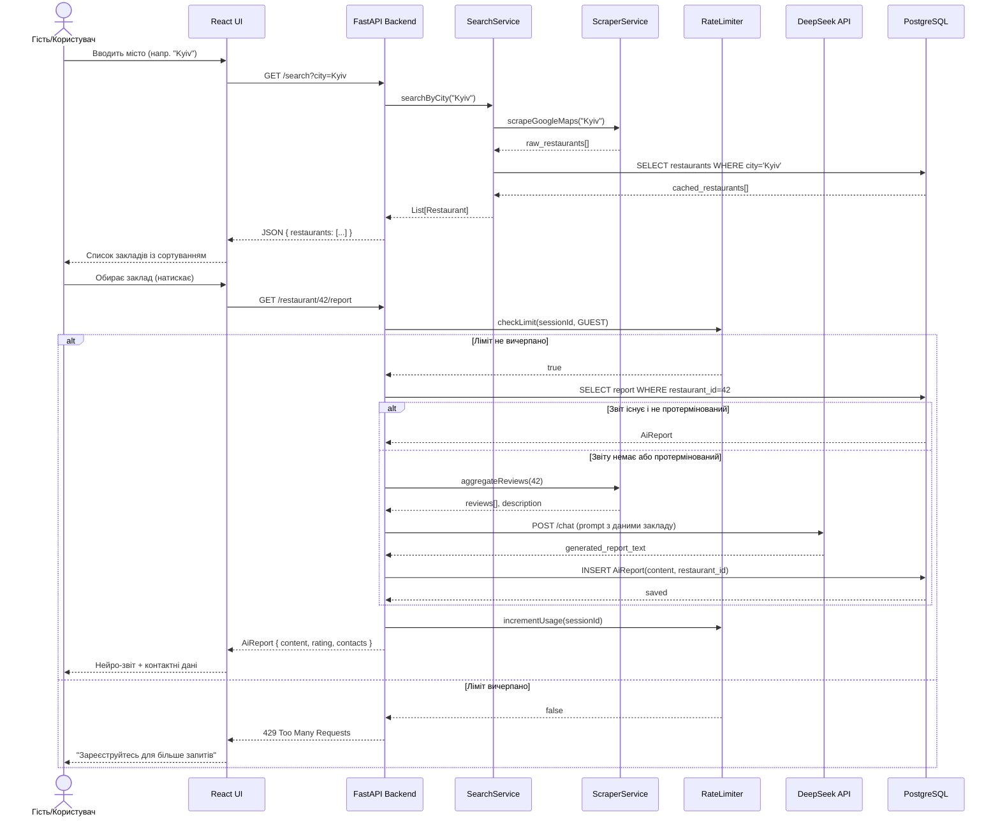

```mermaid
sequenceDiagram
    actor Guest as Гість/Користувач
    participant UI as React UI
    participant API as FastAPI Backend
    participant SS as SearchService
    participant Scraper as ScraperService
    participant RL as RateLimiter
    participant DS as DeepSeek API
    participant DB as PostgreSQL

    Guest->>UI: Вводить місто (напр. "Kyiv")
    UI->>API: GET /search?city=Kyiv
    API->>SS: searchByCity("Kyiv")
    SS->>Scraper: scrapeGoogleMaps("Kyiv")
    Scraper-->>SS: raw_restaurants[]
    SS->>DB: SELECT restaurants WHERE city='Kyiv'
    DB-->>SS: cached_restaurants[]
    SS-->>API: List[Restaurant]
    API-->>UI: JSON { restaurants: [...] }
    UI-->>Guest: Список закладів із сортуванням

    Guest->>UI: Обирає заклад (натискає)
    UI->>API: GET /restaurant/42/report
    API->>RL: checkLimit(sessionId, GUEST)

    alt Ліміт не вичерпано
        RL-->>API: true
        API->>DB: SELECT report WHERE restaurant_id=42
        alt Звіт існує і не протермінований
            DB-->>API: AiReport
        else Звіту немає або протермінований
            API->>Scraper: aggregateReviews(42)
            Scraper-->>API: reviews[], description
            API->>DS: POST /chat (prompt з даними закладу)
            DS-->>API: generated_report_text
            API->>DB: INSERT AiReport(content, restaurant_id)
            DB-->>API: saved
        end
        API->>RL: incrementUsage(sessionId)
        API-->>UI: AiReport { content, rating, contacts }
        UI-->>Guest: Нейро-звіт + контактні дані
    else Ліміт вичерпано
        RL-->>API: false
        API-->>UI: 429 Too Many Requests
        UI-->>Guest: "Зареєструйтесь для більше запитів"
    end
```
