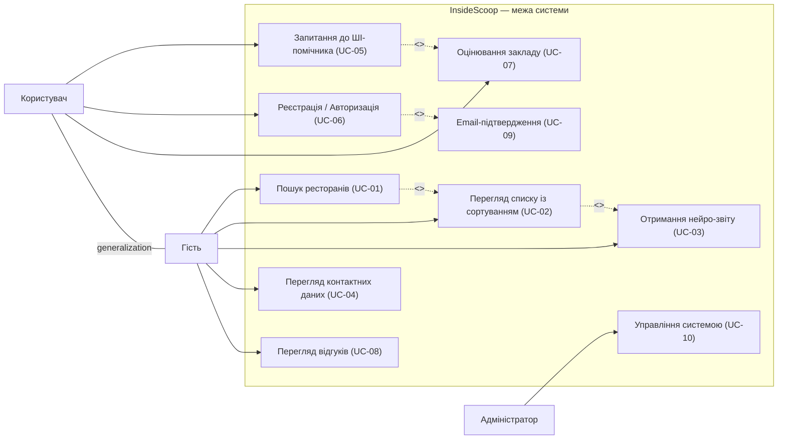

```mermaid
flowchart LR
    Guest["Гість"]
    User["Користувач"]
    Admin["Адміністратор"]

    subgraph SYS["InsideScoop — межа системи"]
        UC01["Пошук ресторанів (UC-01)"]
        UC02["Перегляд списку із сортуванням (UC-02)"]
        UC03["Отримання нейро-звіту (UC-03)"]
        UC04["Перегляд контактних даних (UC-04)"]
        UC05["Запитання до ШІ-помічника (UC-05)"]
        UC06["Реєстрація / Авторизація (UC-06)"]
        UC07["Оцінювання закладу (UC-07)"]
        UC08["Перегляд відгуків (UC-08)"]
        UC09["Email-підтвердження (UC-09)"]
        UC10["Управління системою (UC-10)"]
    end

    Guest --> UC01
    Guest --> UC02
    Guest --> UC03
    Guest --> UC04
    Guest --> UC08
    User --> UC05
    User --> UC06
    User --> UC07
    Admin --> UC10

    UC01 -.->|"<<include>>"| UC02
    UC02 -.->|"<<include>>"| UC03
    UC06 -.->|"<<extend>>"| UC09
    UC05 -.->|"<<extend>>"| UC07
    User ---|generalization| Guest
```
